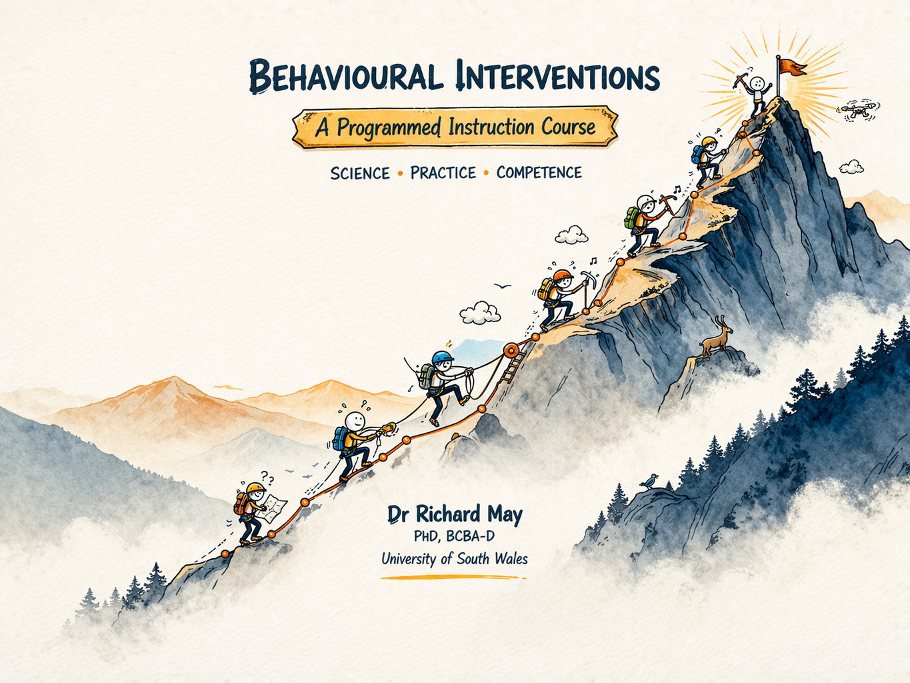

#  {.unnumbered}

{fig-align="center"}

## Introduction

Decades of experimental research have established lawful relationships between behaviour and the environments in which it occurs. These principles, developed largely within the tradition of behaviour analysis, offer more than theoretical description. They provide a generative framework for understanding, predicting, and influencing behaviour across an unusually wide range of contexts and populations.

This course is concerned with the practical application of those principles. It draws on a broad empirical literature from education, clinical psychology, rehabilitation, and public health, to present evidence-based tactics for behavioural intervention. The aim is not to provide a comprehensive theoretical treatment of behaviour analysis, nor to rehearse its philosophical foundations in detail. Those accounts are available elsewhere[@catania2013; @skinner1953]. The aim here is to describe applications that the evidence supports, why they work in functional terms, and how the strategies can be adapted across settings.

The book has been designed as a resource for students taking my MSc-level classes in Behavioural Interventions delivered at the University of South Wales and Reykjavík University. It is intended to complement the in-class sessions and has not been designed as a replacement for them. It has been sequenced to follow the structure of the lecture series, and students taking the course are encouraged to engage with each chapter alongside the corresponding lecture content rather than using the book as a standalone resource. While the book has been written primarily with students enrolled in those courses in mind, anyone with an interest in behavioural interventions or behaviour analysis is welcome to use it.

## The Circumstances View of Behaviour

A defining feature of the behaviour analytic approach is its emphasis on environmental contingencies as the primary determinants of behaviour. Rather than treating behaviour as the product of internal traits, dispositions, or hypothetical mental states, behaviour analysis directs attention to the circumstances in which behaviour occurs and to its function. This is not a denial that biological and individual differences matter; it is a methodological commitment to seeking explanations at the level of behaviour-environment relations, where functional analysis and experimental control are tractable [see @friman2021].

The distinction has practical significance. Explanations that attribute behaviour to internal factors are typically descriptive rather than functional. They restate observations (this person does not engage with treatment; this student does not attend to instruction) in dispositional language, without identifying the variables that could be altered. A circumstances view of behaviour, by contrast, asks which environmental events are evoking and maintaining patterns of behaviour, and what adaptations might be needed for behaviour to change. This reframing is the foundation of behavioural intervention.

## Principles as Tools

The core principles of behaviour analysis such as reinforcement, extinction, stimulus control, motivating operations, schedules and the like, are not merely descriptive categories. Each identifies a specific relationship between environmental variables and classes of responses, and each implies specific points of intervention. This functional character is what puts the analysis in applied behaviour analysis 

Understanding that a behaviour is maintained by intermittent positive reinforcement, for instance, is not simply an observation about the past. It enables a practioner to predict how the behaviour will respond to changes in the reinforcement schedule, what extinction will look like, and what stimuli might acquire discriminative control over the behaviour in question. The practitioner who understands how to use principles as tools is better positioned to design effective interventions, anticipate difficulties, and revise strategies when outcomes fall short of expectation.

The tactics presented across this book are drawn from the evidence base on behaviour analytic interventions and applications. The empirical literature on behavioural intervention is substantial and growing, but it is not uniform; the quality and quantity of studies is often variable. A recurring concern throughout is the quality and status of the evidence underpinning the various approaches covered. Readers will therefore find, alongside practical guidance, an introduction to the tools needed to evaluate evidence critically. 

## Why Programmed Instruction?

Programmed instruction is built on the idea that learning is maximised when it is arranged deliberately, systematically, and in close contact with reinforcement. Rather than passive exposure to information, programmed instruction structures learning as a sequence of small, carefully designed steps in which the learner is required to respond actively at each stage.

This approach emerged from the application of behavioural principles to education. If behaviour is shaped by its consequences, then effective instruction should ensure that correct responding is frequent, errors are minimised, and reinforcement is delivered consistently. Programmed instruction does exactly this. The content in this book is broken into manageable units called *frames*, each requiring a response, and followed immediately by feedback. The sequence is arranged so that learners experience a high rate of success while still being required to discriminate between similar concepts.

## Active Responding

A key feature of programmed instruction is its emphasis on active responding. Learning is treated as a repetoire of behaviour that must be emitted and strengthened. The programme ensures that learners contact the contingencies that strengthen actual learning, rather than merely reading or listening passively. Another defining characteristic is immediate feedback. This reduces the likelihood of repeatly practising inccurate responding and helps establish precise stimulus control.

## Sequencing and Discrimination

The material presented here has also been carefully sequenced. Concepts are introduced in a logical progression, with earlier frames establishing the prerequisites for later ones. Critical distinctions are revisited multiple times across different contexts, promoting discrimination and generalisation. This is particularly important in behaviour analytic course content, where small differences in terminology or procedure can have significant implications.

For learners preparing for certification in behaviour analysis, these features are especially valuable. Passing the professional certification examinations requires that you have a fluent repertoire of terms and definitions, but are also able to discriminate between procedures, identify appropriate applications, and detect subtle errors in implementation. Programmed instruction is well suited to this task because it arranges repeated, varied practice with immediate feedback, all of which contributes to fluency and flexibility.

## Self-Paced and Learner-Controlled

Programmed instruction is designed to be self-paced and learner-controlled. Each learner progresses through the material at a rate determined by their own performance, spending more time where needed (e.g., reviewing previous frames or course readings) and moving quickly through material they have already mastered. This respects individual differences while maintaining consistent instructional quality.

## The Evidence Base

The design principles underlying this book are supported by converging evidence from three bodies of research.

The first is behaviour analysis itself. Programmed instruction emerged directly from Skinner's experimental analysis of behaviour and was developed and refined through applied research across educational and clinical settings [@skinner1958; @kulik1979]. The empirical foundation - that active responding, immediate feedback, and carefully arranged contingencies produce more durable learning than passive exposure - is a well established finding in the behavioural literature.

The second is the literature on retrieval practice. Retrieval practice refers to the act of actively recalling information from memory, as opposed to re-reading or reviewing it passively. A substantial body of research demonstrates that retrieval practice produces significantly better long-term retention than passive study, an effect which has shown to be robust across age groups, subject matter, and educational contexts. The active responding responding component withinc each frame in this book is essentially retrieval practice by another name. [@rowland2014; @adesope2017; @agarwal2021].

The third is research on spaced-practice and interleaving. Distributing practice across time improves retention when compared to massed pratice undertaken in a single study session [@cepeda2006]. Similarly, interspersing related but distinct concepts during practice (i.e., interleaving), rather than studying each in isolation, improves the ability to discriminate between and generalise within concepts [@brunmair2019; @firth2021]. The sequencing of frames in this book, in which concepts are revisited across sections in varied contexts, reflects the incorporation of both of these principles.

## When a "Mistake" is Actually Helpful

Occasionally, you might enter an answer that is technically correct, but the frame feedback will ask you to try again. This may be because it doesn't recognise the specific response you have entered. This can feel frustrating at first; however, this is a feature of the system that can actually be beneficial for learning. 

From a learning science perspective, the moment of surprise this creates what is known as a prediction error: a mismatch between what you expected (that your answer would be accepted) and what actually happened (your answer was rejected). Research across a range of disciplines shows that these such prediction errors are an especially powerful driver of learning[@Schultz2016; @RescorlaWagner1972;    @Kornell2009; @Reuter2019].

Paradoxically, when an outcome is unexpected, it captures attention and strengthens memory for the correct response. So, if you are asked to retype an answer, think of it this way: What might feel like a small obstacle is actually doing useful work behind the scenes. In that sense, you can think of it as feature of the system, rather than a bug.

If you receive an incorrect response, first review the feedback and check for any errors in how you entered the word. Then review the previous frames that you have completed. If you are confident your entry is correct, try to think of an alternative word that conveys the same meaning within the context of the sentence. If you are still unsure, please don’t hesitate to reach out for support. 

## How to Use This Book

In this book, I have organised the content according to these principles. You will be asked to respond frequently, to discriminate between similar concepts, and to apply procedures across a range of scenarios. If you find the format a little demanding, that is by design. The goal is not simply to expose you to the material, but to establish actice responding that will help the targeted repetoires to last.

Each time you complete a chapter with all questions answered correctly, you will unlock access to The Token Exchange. In this section, you will be given five of multiple-choice questions based on the chapter content, with opportunities to potentially win prizes. You read more about (and access) the Token Exchange here:[Token Exchange](slot-machine.qmd)

If you notice any mistakes in the text of this book, you can help by emailing me at richard.may@southwales.ac.uk.

::: callout-important
## Before you begin

Approach each frame actively. Attempt a response before checking the answer. Treat errors as opportunities to refine your understanding by reviewing the material, and not as failures. Over time, the repeated contact with these contingencies will produce a repertoire of behaviour that passive study methods rarely achieve.

:::

## 
