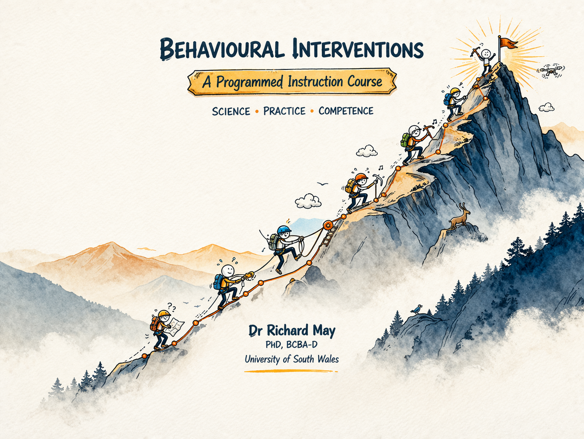

#  {.unnumbered}

{fig-align="center"}

## Introduction

Decades of experimental research have established lawful relationships between behaviour and the environments in which it occurs. These principles, developed largely within the tradition of behaviour analysis, offer more than theoretical description. They provide a generative framework for understanding, predicting, and influencing behaviour across an unusually wide range of contexts and populations.

This course is concerned with the practical application of those principles. It draws on a broad empirical literature from education, clinical psychology, rehabilitation, and public health, to present evidence-based tactics for behavioural intervention. The aim is to describe evidence-based applications and why they work in functional terms, and explore how they can be adapted across settings. The course isn't a comprehensive theoretical or philosophical treatment of behaviour analysis. There are plenty of resources exploring those domains elsewhere[@catania2013; @skinner1953]. 

Primarily, the book has been designed as a resource for students taking my MSc class in Behavioural Interventions. It is intended as a companion to the in-class sessions rather than as a replacement. The sequence of chapters mirrors the structure of the lectures, and students taking the course are encouraged to engage with each topic as they encounter the in-class content rather than using the book as a standalone resource. While I developed the book with my students in mind, anyone with an interest in behavioural interventions or behaviour analysis is welcome to use it.

## The Circumstances View of Behaviour

A defining feature of the behaviour analytic approach is its emphasis on environmental contingencies as the primary driver of behaviour. A behaviour analysis directs attention to the circumstances or context in which behaviour occurs and to the purpose it has served (or more technically, its 'function'), rather than treating it as the product of traits, dispositions, or hypothetical mental states. This stance is a methodological commitment to seeking explanations at the level of behaviour-environment relations. It is not a denial that biological and individual differences matter. A key advantage of this approach is one of practiciality; it is in the environment where functional analysis and experimental control are tractable [see @friman2021].

The distinction between environmental and individual characteristics have significance in understanding behaviour. Explanations that attribute behaviour to internal factors are typically descriptive rather than functional. They often lead to restating observations (this person does not engage with treatment; this student does not attend to instruction) in dispositional language, without identifying the contextual variables that can be altered. A circumstances view of behaviour (i.e., a behaviour analysis), by contrast, asks, "which environmental events are evoking and maintaining patterns of behaviour?", and "what adaptations might be needed for behaviour to change?" This reframing is the foundation of behaviour analytic intervention.

## Principles as Tools

The core toolkit of a behaviour analyst consist of principles of behaviour such as reinforcement, extinction, stimulus control, motivating operations, schedules and the like. These principles of behaviour represent hard-won knowledge about lawful relations between behaviour and environment, accumulated through decades of experimental and applied work in operant conditioning. Each identifies a specific relationship between environmental variables and patterns of behaviour that emerge. This functional character is what puts the 'analysis' in applied behaviour analysis. 

Understanding that a behaviour is maintained by intermittent positive reinforcement, for instance, enables a practioner to predict how someone will respond to changes in the reinforcement schedule, what removal or witholdingof reinforcement will look like, and what stimuli might come to acquire control over the behaviour. The practitioner who understands how to use these principles as tools is better positioned to design effective interventions, anticipate difficulties, and revise strategies when outcomes of fall short of expectations.

The tactics presented in the chapters that follow are drawn from the evidence base on behaviour analytic interventions and applications. The empirical literature on behavioural intervention is substantial and growing, but it is not uniform; the quality and quantity of studies is often variable. This is a topic that I have explored at length in some of my own research work here: @may2022; and here: @may2026. Accordingly, a recurring concern throughout the book is the quality and status of the evidence underpinning the various approaches covered. The reader will therefore find, alongside practical guidance, an introduction to some of the tools needed to evaluate evidence and claims critically. 

## Why Programmed Instruction?

Programmed instruction is built on the idea that learning is maximised when it is arranged deliberately, systematically, and in close contact with reinforcement. Programmed instruction structures learning as a sequence of small, carefully designed steps in which the learner is required to respond actively at each stage.

This approach emerged from the application of behavioural principles to education. If behaviour is shaped by its consequences, then effective instruction should ensure that correct responding is frequent, errors are minimised, and reinforcement is delivered consistently. Programmed instruction does exactly this. The content in this book is broken into manageable units called *frames*, each requiring a response, and followed immediately by feedback. The sequence is arranged so that learners experience a high rate of success while still being required to discriminate between concepts.

## Active Responding

A hallmark of programmed instruction is its shift from passive consumption to active responding. This method views the acquisition of knowledge as the acquisition of a repertoire of behavior which is built and reinforced. By requiring frequent, overt responses the program ensures the learner is an active participant in the learning process not a passive bystander. Instant confirmation of a correct response functions as reinforcement, while immediate correction prevents the rehearsal of errors. This tight loop of action and feedback helps establish the solid foundation necessary for the development of fluency.

## Sequencing and Discrimination

As much as is possible I have tried to organise the material in a way so that concepts are introduced and develop in a logical way with earlier frames establishing the prerequisites for later ones. Critical distinctions are revisited multiple times across different contexts, promoting both discrimination between, and generalisation within, concepts. This is particularly important in behaviour analytic course content, where seemingly minor differences in terminology or procedures can have significant implications.

For learners preparing for certification in behaviour analysis, these features are especially valuable. Passing the professional certification examinations requires that you have a fluent repertoire of terms and definitions, but that you are also able to discriminate between procedures, identify appropriate applications, and detect subtle errors in implementation. Programmed instruction is well suited to this task because it arranges repeated, varied practice with immediate feedback, all of which contributes to fluency and flexibility.

## Self-Paced and Learner-Controlled

Programmed instruction is designed to be self-paced and learner-controlled. Each learner progresses through the material at a rate determined by their own performance, spending more time where needed (e.g., reviewing previous frames or course readings) and moving quickly through material they have already mastered. This respects individual differences while maintaining consistent instructional quality.

## The Evidence Base

The design principles underlying this book are supported by converging evidence from three bodies of research.

The first is behaviour analysis itself. Programmed instruction emerged directly from Skinner's experimental analysis of behaviour and was refined through a program of applied research across educational and clinical environments [@skinner1958; @kulik1979]. It is a well established finding that active responding, immediate feedback, and carefully arranged contingencies produce more durable learning than passive exposure.

The second is the literature on retrieval practice. Retrieval refers to the act of recalling information from memory, as opposed to re-reading or reviewing it passively. A substantial body of research demonstrates that retrieval practice produces significantly better long-term retention than passive study, an effect which has replicated across age groups, subject matter, and educational contexts. The active responding requirements within each section of this book is essentially retrieval practice by another name. [@rowland2014; @adesope2017; @agarwal2021].

The third is research on spaced-practice and interleaving. Distributing (or spacing) practice across time improves retention when compared to massed pratice undertaken in a single study session [@cepeda2006]. Similarly, interspersing related but distinct concepts during practice (i.e., interleaving) improves discrimination between and generalisation within concepts [@brunmair2019; @firth2021]. The sequencing of frames in this book, in which concepts are revisited across sections in varied contexts, reflects the incorporation of both of these principles.

## When a "Mistake" is Actually Helpful

Occasionally, you might enter an answer that is technically correct, but the feedback will ask you to try again. This is because the program doesn't recognise the specific term you entered. While this can feel frustrating, this is a feature of the system that can actually be beneficial for learning. 

From a learning perspective, the moment of surprise this creates is known as a prediction error: a mismatch between what you expected (that your answer would be accepted) and what actually happened (your answer was rejected). Research in a variety of domains shows that prediction errors are a powerful driver of learning[@Schultz2016; @RescorlaWagner1972;  @Kornell2009; @Reuter2019].

Paradoxically, when an outcome is unexpected, it captures attention and strengthens memory for the correct response. So, if you are asked to retype an answer, think of it this way: What might feel like a small obstacle is actually doing useful work behind the scenes. In that sense, you can think of it as feature of the system, rather than a bug.

If you receive an incorrect response, first review the feedback and check for any errors in how you entered the word. Then review the previous frames that you have completed. If you are confident your entry is correct, try to think of an alternative word that conveys the same meaning within the context of the sentence. If you are still unsure, please don’t hesitate to reach out for support. 

## How to Use This Book

In this book, I have organised the content according to these principles. You will be asked to respond frequently, to discriminate between similar concepts, and to apply procedures across a range of scenarios. If you find the format a little demanding, that is by design. My aim is not just to expose you to the material, but to prompt responding that will help the targeted repertoires to be understood and retained.

Each time you complete a chapter with all questions answered correctly, you will unlock access to The Token Exchange. On this part of the site, you will be invited to complete five multiple-choice questions based on the chapter content, with opportunities to potentially win prizes. You can read more about (and access) the Token Exchange here:[Token Exchange](slot-machine.qmd)

Lastly, this site is very much a work in progress, so if you happen to notice any mistakes then you can help by emailing me at richard.may@southwales.ac.uk.

::: callout-important
## Before you begin

Approach each frame actively. Attempt a response before checking the answer. Treat errors as opportunities to refine your understanding by reviewing the material, and not as failures. Over time, the repeated contact with these contingencies will produce a repertoire of behaviour that passive study methods rarely achieve.

:::

## 
