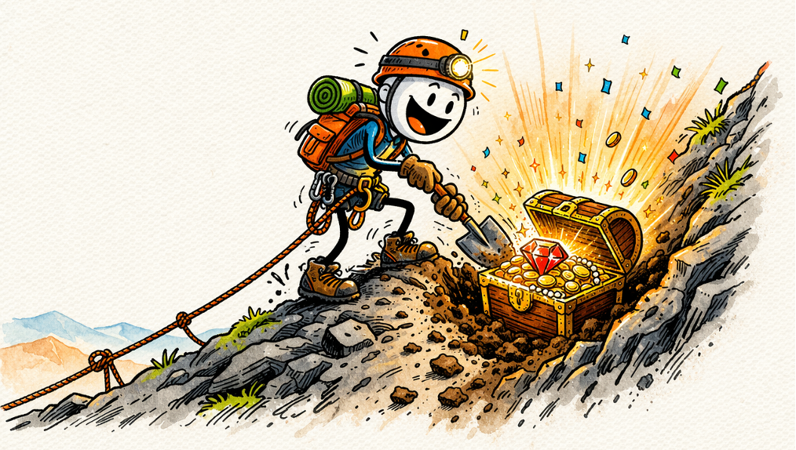

## The Token Exchange {.unnumbered}

{fig-align="center"}

Every chapter in this book is built on the principles of behaviour analysis. So is this.

When you complete all the frames in a chapter correctly, you unlock a visit to the Token Exchange. Each visit gives you five multiple choice questions drawn from that chapter's content. Answer a question correctly and you will earn one spin on the machine. Answer incorrectly and no spin is awarded, but you still get the corrective feedback.

The machine runs on a Random Ratio (RR) schedule. This means each spin has an independent probability of producing a win, regardless of the outcome of any previous spin. Unlike a Variable Ratio schedule, a RR schedule has no memory. Think as each spin is equivalent to a coin flip. The schedule does not know or care how many times you have spun without winning, and there is no such thing as a spin that is "due." 

## Spin to win {.unnumbered}

Behaviour analysts have long recognised that immediate, arbitrary reinforcers can supplement more distal natural contingencies during the acquisition phase of learning, particularly when natural reinforcers are delayed. The Token Exchange applies that principle here with backup reinforcers available to via the RR schedule. Completing a chapter earns you access to a game. Correctly answering questions in the game earns you spins. A win earns you a code.
If you are taking my Behavioural Interventions class in-person, a winning code can be redeemed for a small prize. Screenshot your code and email it to me to claim your prize. Each winning code is unique and can only be redeemed once.

[🎰 Open the Token Exchange](../token-exchange.html){target="_blank" .btn .btn-primary}

## Recording Progress {.unnumbered}

You can check out your progress in the table below. It will record each completed chapter and whether you have visited the Token Exchange for that chapter. 

Your chapter completion records, visit history, and any prize codes you have earned are stored locally in your browser using a technology called local storage. This means your progress is tied to the specific browser you are using on the specific device you are using it on.

If you open the book in a different browser, use a private or incognito window, clear your browser history or site data, or switch to a different device, your progress will not carry over. No data is transmitted to any server — everything is stored on your own machine.

To avoid losing your progress, use the same browser on the same device throughout the course. If you win a prize code and want to claim your prize, then screenshot it immediately. If you clear your browser data before redeeming it, the code will be gone.

This also means that no data about your performance, progress, or responses is collected, stored, or accessible by anyone other than you. Dr May cannot see how many frames you have completed, how many spins you have taken, or whether you have won. The system is entirely private and your internet browser is the only place any of this information exists.

## Your Progress
```{=html}
<div id="chapter-status"></div>
<script>
const CHAPTERS = {
  g: 'Chapter 1: Selecting Intervention Goals',
  v: 'Chapter 2: Evidence-Based Practice',
  f: 'Chapter 3: Differential Reinforcement',
  a: 'Chapter 4: Antecedent Interventions',
  e: 'Chapter 5: Extinction',
  t: 'Chapter 6: Treatment Fidelity',
  b: 'Chapter 7: Engagement'
};
function renderStatus() {
  let rec = {};
  try { rec = JSON.parse(localStorage.getItem('ba_chapter_completions') || '{}'); } catch {}
  
  const el = document.getElementById('chapter-status');
  let html = '<table style="width:100%;border-collapse:collapse;font-size:0.9rem">';
  html += '<tr><th style="text-align:left;padding:0.5rem;border-bottom:1px solid #ddd">Chapter</th><th style="padding:0.5rem;border-bottom:1px solid #ddd">Completed</th><th style="padding:0.5rem;border-bottom:1px solid #ddd">Visit used</th></tr>';
  
  Object.entries(CHAPTERS).forEach(([prefix, name]) => {
    const data = rec[prefix];
    const done = data && data.completed ? '✓' : '—';
    const used = data && data.visitUsed ? '✓' : '—';
    html += '<tr>';
    html += '<td style="padding:0.5rem;border-bottom:1px solid #eee">' + name + '</td>';
    html += '<td style="text-align:center;padding:0.5rem;border-bottom:1px solid #eee;color:' + (data&&data.completed?'#059669':'#999') + '">' + done + '</td>';
    html += '<td style="text-align:center;padding:0.5rem;border-bottom:1px solid #eee;color:' + (data&&data.visitUsed?'#2563eb':'#999') + '">' + used + '</td>';
    html += '</tr>';
  });
  
  html += '</table>';
  el.innerHTML = html;
}

renderStatus();
</script>
```


## Deleting Your Progress {.unnumbered}

If you want to clear your progress and start the course again you can do this by clearing your browser's local storage for this site. The steps vary slightly by browser:

#Chrome / Edge:

Settings → Privacy and Security → Site Settings → View permissions and data stored across sites → find the site → Delete

#Firefox:

Settings → Privacy and Security → Cookies and Site Data → Manage Data → find the site → Remove Selected

#Safari

Settings → Privacy → Manage Website Data → find the site → Remove


